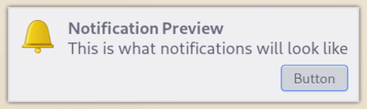

<h3 align="center">
	<br/>
	
	Catppuccin for <a href="https://github.com/Zwork101/xfce4-notifyd-themes">xfce4-notifyd</a>
	
</h3>

<p align="center">
	<a href="https://github.com/catppuccin/pomotroid/stargazers"></a>
	<a href="https://github.com/Zwork101/xfce4-notifyd-themes/issues"></a>
	<a href="https://github.com/Zwork101/xfce4-notifyd-themes/contributors"></a>
</p>

<p align="center">
	
</p>

## Previews

<details>
<summary>🌻 Latte</summary>

</details>
<details>
<summary>🪴 Frappé</summary>

</details>
<details>
<summary>🌺 Macchiato</summary>

</details>
<details>
<summary>🌿 Mocha</summary>

</details>

## Installation

```bash
git clone https://github.com/Zwork101/xfce4-notifyd-themes.git
mkdir ~/.themes
cp -r xfce4-notifyd-themes/catppuccin-* ~/.themes
```

### Usage

Open the xfce4-notifyd settings using:
```
xfce4-notifyd-config
```
Then navigate to Appearance. In the theme drop down selected the desired theme.

## 🙋 FAQ

-   Q: **_"Why is my notification border the wrong color"_**\
    A: Many window managers change the borders of windows. Check your config to see if there is a conflict.

## 💝 Thanks to

-   [Zwork101](https://github.com/Zwork101)

&nbsp;

<p align="center">
	
</p>

<p align="center">
	Copyright &copy; 2021-present <a href="https://github.com/catppuccin" target="_blank">Catppuccin Org</a>
</p>

<p align="center">
	<a href="https://github.com/catppuccin/catppuccin/blob/main/LICENSE"></a>
</p>